Chapter 3 Notes
================
First created on Nov 7, 2019. Updated on Nov 12, 2019

  - [Chapter 3 Notes](#chapter-3-notes)
      - [Build Simulated Database](#build-simulated-database)

## Chapter 3 Notes

### Build Simulated Database

For 20 stores, and 2 years worth of weekly data (104 weeks)

``` r
k.stores <- 20     # 20 stores
k.weeks <- 104     # 2 years = 104 weeks

# create the table
store.df <- data.frame(matrix(NA, ncol=10, nrow=k.stores*k.weeks))
```

Then:

  - Name the columns and check the dimensions
  - setup vectors for the store number and country (and check length)
  - then expand the vectors and insert into the table

<!-- end list -->

``` r
# name the columns
names(store.df) <- c("storeNum", "Year", "Week", "p1sales", "p2sales",
                     "p1price", "p2price", "p1prom", "p2prom", "country")
dim(store.df)
```

    ## [1] 2080   10

``` r
# create vectors for store number and country
store.num <- 101:(100+k.stores)
store.cty <- c(rep("US", 3), rep("DE", 5), rep("GB", 3), rep("BR", 2),
                   rep("JP", 4), rep("AU", 1), rep("CN", 2))

length(store.num) # both length = 20
```

    ## [1] 20

``` r
length(store.cty)
```

    ## [1] 20

``` r
# now replace the vectors using rep to expand them
store.df$storeNum <- rep(store.num, each=k.weeks)
store.df$country <- rep(store.cty, each=k.weeks)

# cleanup
rm(store.num, store.cty)
```

Then create the data for Week and Year columns

``` r
# now create week and year columns
store.df$Week <- rep(1:52, times=k.stores*2)
store.df$Year <- rep(1:2, each=k.weeks/2, times=k.stores)

# now check the structure
str(store.df)
```

    ## 'data.frame':    2080 obs. of  10 variables:
    ##  $ storeNum: int  101 101 101 101 101 101 101 101 101 101 ...
    ##  $ Year    : int  1 1 1 1 1 1 1 1 1 1 ...
    ##  $ Week    : int  1 2 3 4 5 6 7 8 9 10 ...
    ##  $ p1sales : logi  NA NA NA NA NA NA ...
    ##  $ p2sales : logi  NA NA NA NA NA NA ...
    ##  $ p1price : logi  NA NA NA NA NA NA ...
    ##  $ p2price : logi  NA NA NA NA NA NA ...
    ##  $ p1prom  : logi  NA NA NA NA NA NA ...
    ##  $ p2prom  : logi  NA NA NA NA NA NA ...
    ##  $ country : chr  "US" "US" "US" "US" ...

``` r
# redefine storeNum and country as factors
store.df$storeNum <- factor(store.df$storeNum)
store.df$country <- factor(store.df$country)

# check structure again
str(store.df)
```

    ## 'data.frame':    2080 obs. of  10 variables:
    ##  $ storeNum: Factor w/ 20 levels "101","102","103",..: 1 1 1 1 1 1 1 1 1 1 ...
    ##  $ Year    : int  1 1 1 1 1 1 1 1 1 1 ...
    ##  $ Week    : int  1 2 3 4 5 6 7 8 9 10 ...
    ##  $ p1sales : logi  NA NA NA NA NA NA ...
    ##  $ p2sales : logi  NA NA NA NA NA NA ...
    ##  $ p1price : logi  NA NA NA NA NA NA ...
    ##  $ p2price : logi  NA NA NA NA NA NA ...
    ##  $ p1prom  : logi  NA NA NA NA NA NA ...
    ##  $ p2prom  : logi  NA NA NA NA NA NA ...
    ##  $ country : Factor w/ 7 levels "AU","BR","CN",..: 7 7 7 7 7 7 7 7 7 7 ...

``` r
# look at the first 6 rows
head(store.df)
```

    ##   storeNum Year Week p1sales p2sales p1price p2price p1prom p2prom country
    ## 1      101    1    1      NA      NA      NA      NA     NA     NA      US
    ## 2      101    1    2      NA      NA      NA      NA     NA     NA      US
    ## 3      101    1    3      NA      NA      NA      NA     NA     NA      US
    ## 4      101    1    4      NA      NA      NA      NA     NA     NA      US
    ## 5      101    1    5      NA      NA      NA      NA     NA     NA      US
    ## 6      101    1    6      NA      NA      NA      NA     NA     NA      US

``` r
# look at the last 6 rows
tail(store.df)
```

    ##      storeNum Year Week p1sales p2sales p1price p2price p1prom p2prom country
    ## 2075      120    2   47      NA      NA      NA      NA     NA     NA      CN
    ## 2076      120    2   48      NA      NA      NA      NA     NA     NA      CN
    ## 2077      120    2   49      NA      NA      NA      NA     NA     NA      CN
    ## 2078      120    2   50      NA      NA      NA      NA     NA     NA      CN
    ## 2079      120    2   51      NA      NA      NA      NA     NA     NA      CN
    ## 2080      120    2   52      NA      NA      NA      NA     NA     NA      CN

Then create some random store data:

  - set the seed (so you can replicate)
  - use the rbinom() function to randomly put 1s in 10% of p1prom
  - use the rbinom() function to randomly put 1s in 15% of p2prom
  - then setup p1price by sampling a set of 5 prices and replacing the
    values
  - do the same for p2price

<!-- end list -->

``` r
# set the seed so we can replicate
set.seed(98250)

store.df$p1prom <- rbinom(n=nrow(store.df), size=1, p=0.1)   # 10% prob of promotion
store.df$p2prom <- rbinom(n=nrow(store.df), size=1, p=0.15)  # 15% prob of promotion

# look at it
head(store.df)
```

    ##   storeNum Year Week p1sales p2sales p1price p2price p1prom p2prom country
    ## 1      101    1    1      NA      NA      NA      NA      0      0      US
    ## 2      101    1    2      NA      NA      NA      NA      0      0      US
    ## 3      101    1    3      NA      NA      NA      NA      1      0      US
    ## 4      101    1    4      NA      NA      NA      NA      0      0      US
    ## 5      101    1    5      NA      NA      NA      NA      0      1      US
    ## 6      101    1    6      NA      NA      NA      NA      0      0      US

``` r
str(store.df)
```

    ## 'data.frame':    2080 obs. of  10 variables:
    ##  $ storeNum: Factor w/ 20 levels "101","102","103",..: 1 1 1 1 1 1 1 1 1 1 ...
    ##  $ Year    : int  1 1 1 1 1 1 1 1 1 1 ...
    ##  $ Week    : int  1 2 3 4 5 6 7 8 9 10 ...
    ##  $ p1sales : logi  NA NA NA NA NA NA ...
    ##  $ p2sales : logi  NA NA NA NA NA NA ...
    ##  $ p1price : logi  NA NA NA NA NA NA ...
    ##  $ p2price : logi  NA NA NA NA NA NA ...
    ##  $ p1prom  : int  0 0 1 0 0 0 0 0 0 0 ...
    ##  $ p2prom  : int  0 0 0 0 1 0 0 0 0 0 ...
    ##  $ country : Factor w/ 7 levels "AU","BR","CN",..: 7 7 7 7 7 7 7 7 7 7 ...

``` r
# now each prod sold at 5 price pts from $2.19 to $3.19 overall
# draw a price for each week 
store.df$p1price <- sample(x=c(2.19, 2.29, 2.49, 2.79, 2.99),
                           size=nrow(store.df), replace=TRUE)
store.df$p2price <- sample(x=c(2.29, 2.49, 2.59, 2.99, 3.19),
                           size=nrow(store.df), replace=TRUE)
# look at it
str(store.df)
```

    ## 'data.frame':    2080 obs. of  10 variables:
    ##  $ storeNum: Factor w/ 20 levels "101","102","103",..: 1 1 1 1 1 1 1 1 1 1 ...
    ##  $ Year    : int  1 1 1 1 1 1 1 1 1 1 ...
    ##  $ Week    : int  1 2 3 4 5 6 7 8 9 10 ...
    ##  $ p1sales : logi  NA NA NA NA NA NA ...
    ##  $ p2sales : logi  NA NA NA NA NA NA ...
    ##  $ p1price : num  2.79 2.79 2.49 2.49 2.49 2.29 2.29 2.29 2.79 2.49 ...
    ##  $ p2price : num  2.99 2.59 3.19 2.49 3.19 3.19 2.99 2.49 2.99 2.29 ...
    ##  $ p1prom  : int  0 0 1 0 0 0 0 0 0 0 ...
    ##  $ p2prom  : int  0 0 0 0 1 0 0 0 0 0 ...
    ##  $ country : Factor w/ 7 levels "AU","BR","CN",..: 7 7 7 7 7 7 7 7 7 7 ...

Next, set up sales data using poison (counts) distribution, rpois()

``` r
# first, the default sales in absence of promotion
tmp.sales1 <- rpois(nrow(store.df), lambda=120)
tmp.sales2 <- rpois(nrow(store.df), lambda=100)
```

Now scale the counts using log function, since price effects often
follow logarithmic function rather than linear not assuming prices vary
inversely - proce of prod1 goes up as price of prod2 is lower

``` r
tmp.sales1 <- tmp.sales1*log(store.df$p2price)/log(store.df$p1price)
tmp.sales2 <- tmp.sales2*log(store.df$p1price)/log(store.df$p2price)
```

Finally give each sales a 30% or 40% lift when promoted multiply promo
status vector by .3 or .4 then multiply by sales use floor to drop
fractional values

``` r
store.df$p1sales <- floor(tmp.sales1*(1 + store.df$p1prom*0.3))
store.df$p2sales <- floor(tmp.sales2*(1 + store.df$p2prom*0.4))

# look at the data.frame again
head(store.df)
```

    ##   storeNum Year Week p1sales p2sales p1price p2price p1prom p2prom country
    ## 1      101    1    1     130      88    2.79    2.99      0      0      US
    ## 2      101    1    2     111     101    2.79    2.59      0      0      US
    ## 3      101    1    3     226      85    2.49    3.19      1      0      US
    ## 4      101    1    4     118     119    2.49    2.49      0      0      US
    ## 5      101    1    5     137      96    2.49    3.19      0      1      US
    ## 6      101    1    6     182      67    2.29    3.19      0      0      US

``` r
str(store.df)
```

    ## 'data.frame':    2080 obs. of  10 variables:
    ##  $ storeNum: Factor w/ 20 levels "101","102","103",..: 1 1 1 1 1 1 1 1 1 1 ...
    ##  $ Year    : int  1 1 1 1 1 1 1 1 1 1 ...
    ##  $ Week    : int  1 2 3 4 5 6 7 8 9 10 ...
    ##  $ p1sales : num  130 111 226 118 137 182 145 125 118 108 ...
    ##  $ p2sales : num  88 101 85 119 96 67 80 88 94 96 ...
    ##  $ p1price : num  2.79 2.79 2.49 2.49 2.49 2.29 2.29 2.29 2.79 2.49 ...
    ##  $ p2price : num  2.99 2.59 3.19 2.49 3.19 3.19 2.99 2.49 2.99 2.29 ...
    ##  $ p1prom  : int  0 0 1 0 0 0 0 0 0 0 ...
    ##  $ p2prom  : int  0 0 0 0 1 0 0 0 0 0 ...
    ##  $ country : Factor w/ 7 levels "AU","BR","CN",..: 7 7 7 7 7 7 7 7 7 7 ...

``` r
library(car) # for the some() function
```

    ## Loading required package: carData

``` r
some(store.df, 10)
```

    ##      storeNum Year Week p1sales p2sales p1price p2price p1prom p2prom country
    ## 91        101    2   39     133      82    2.29    2.29      0      0      US
    ## 237       103    1   29     130     106    2.99    2.99      0      0      US
    ## 830       108    2   50     128     100    2.79    3.19      0      0      DE
    ## 897       109    2   13     152      75    2.19    2.59      0      0      GB
    ## 1083      111    1   43     144     114    2.49    2.29      1      0      GB
    ## 1445      114    2   41     129     105    2.99    2.99      0      0      JP
    ## 1468      115    1   12     182      61    2.19    3.19      0      0      JP
    ## 1943      119    2   19     144     126    2.79    3.19      0      1      CN
    ## 1988      120    1   12     108      93    2.49    2.29      0      0      CN
    ## 2053      120    2   25     187      67    2.29    3.19      0      0      CN

``` r
# count how many times prod 1 was on sale at each of the 5 price points
p1.table <- table(store.df$p1price)
# plot it (about the same number of times at each price pt)
plot(p1.table)

# how often was p1 promoted at each price
table(store.df$p1price, store.df$p1prom)
```

    ##       
    ##          0   1
    ##   2.19 374  45
    ##   2.29 396  46
    ##   2.49 365  46
    ##   2.79 346  39
    ##   2.99 391  32

``` r
# we set p1 to be promoted about 10% of the time
p1.table2 <- table(store.df$p1price, store.df$p1prom)

# divide the second column by the sum of the first and second columns
p1.table2[, 2]/(p1.table2[, 1] + p1.table2[, 2])
```

    ##       2.19       2.29       2.49       2.79       2.99 
    ## 0.10739857 0.10407240 0.11192214 0.10129870 0.07565012

``` r
# min and max store sales
min(store.df$p1sales)
```

    ## [1] 66

``` r
max(store.df$p1sales)
```

    ## [1] 267

``` r
mean(store.df$p1sales)
```

    ## [1] 133.7159

``` r
var(store.df$p1sales)
```

    ## [1] 850.9308

``` r
sd(store.df$p1sales)
```

    ## [1] 29.17072

``` r
IQR(store.df$p1sales)   # interquartile range
```

    ## [1] 38

``` r
mad(store.df$p1sales)   # median absolute deviation
```

    ## [1] 28.1694

``` r
quantile(store.df$p1sales, probs=c(0.25, 0.5, 0.75))
```

    ## 25% 50% 75% 
    ## 113 130 151

``` r
quantile(store.df$p1sales, probs=c(0.05, 0.95))
```

    ##  5% 95% 
    ##  92 186

``` r
quantile(store.df$p1sales, probs=0:10/10) # probs=c(0, 1/10, 2/20, ...)
```

    ##   0%  10%  20%  30%  40%  50%  60%  70%  80%  90% 100% 
    ##   66   99  109  116  123  130  137  146  156  174  267

``` r
# create a summary of sales for prod 1 and 2 based on median and IQR
mysummary.df <- data.frame((matrix(NA, nrow=2, ncol=2)))
names(mysummary.df) <- c("Median Sales", "IQR")
rownames(mysummary.df) <- c("Product 1", "Product 2")

mysummary.df["Product 1", "Median Sales"] <- median(store.df$p1sales)
mysummary.df["Product 2", "Median Sales"] <- median(store.df$p2sales)

mysummary.df["Product 1", "IQR"] <- IQR(store.df$p1sales)
mysummary.df["Product 2", "IQR"] <- IQR(store.df$p2sales)

mysummary.df  # median sales higher and more variation for product 1
```

    ##           Median Sales IQR
    ## Product 1          130  38
    ## Product 2           96  31

``` r
library(psych)
```

    ## 
    ## Attaching package: 'psych'

    ## The following object is masked from 'package:car':
    ## 
    ##     logit

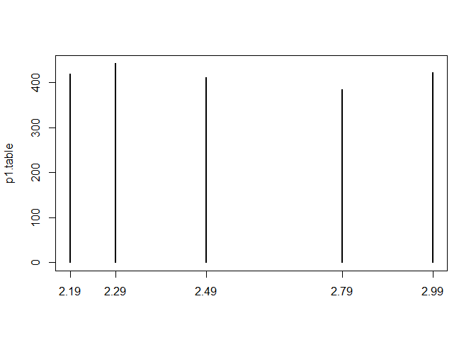<!-- -->

``` r
describe(store.df)  # note * on output for storeNum and country
```

    ##           vars    n   mean    sd median trimmed   mad   min    max range  skew
    ## storeNum*    1 2080  10.50  5.77  10.50   10.50  7.41  1.00  20.00  19.0  0.00
    ## Year         2 2080   1.50  0.50   1.50    1.50  0.74  1.00   2.00   1.0  0.00
    ## Week         3 2080  26.50 15.01  26.50   26.50 19.27  1.00  52.00  51.0  0.00
    ## p1sales      4 2080 133.72 29.17 130.00  131.73 28.17 66.00 267.00 201.0  0.69
    ## p2sales      5 2080  99.63 24.22  96.00   97.48 22.24 54.00 201.00 147.0  0.97
    ## p1price      6 2080   2.54  0.30   2.49    2.53  0.44  2.19   2.99   0.8  0.30
    ## p2price      7 2080   2.71  0.33   2.59    2.70  0.44  2.29   3.19   0.9  0.22
    ## p1prom       8 2080   0.10  0.30   0.00    0.00  0.00  0.00   1.00   1.0  2.66
    ## p2prom       9 2080   0.14  0.35   0.00    0.05  0.00  0.00   1.00   1.0  2.09
    ## country*    10 2080   4.55  1.72   4.50    4.62  2.22  1.00   7.00   6.0 -0.29
    ##           kurtosis   se
    ## storeNum*    -1.21 0.13
    ## Year         -2.00 0.01
    ## Week         -1.20 0.33
    ## p1sales       0.46 0.64
    ## p2sales       1.27 0.53
    ## p1price      -1.47 0.01
    ## p2price      -1.46 0.01
    ## p1prom        5.10 0.01
    ## p2prom        2.38 0.01
    ## country*     -0.81 0.04

``` r
# repeat describe excluding these
describe(store.df[, c(2, 4:9)])
```

    ##         vars    n   mean    sd median trimmed   mad   min    max range skew
    ## Year       1 2080   1.50  0.50   1.50    1.50  0.74  1.00   2.00   1.0 0.00
    ## p1sales    2 2080 133.72 29.17 130.00  131.73 28.17 66.00 267.00 201.0 0.69
    ## p2sales    3 2080  99.63 24.22  96.00   97.48 22.24 54.00 201.00 147.0 0.97
    ## p1price    4 2080   2.54  0.30   2.49    2.53  0.44  2.19   2.99   0.8 0.30
    ## p2price    5 2080   2.71  0.33   2.59    2.70  0.44  2.29   3.19   0.9 0.22
    ## p1prom     6 2080   0.10  0.30   0.00    0.00  0.00  0.00   1.00   1.0 2.66
    ## p2prom     7 2080   0.14  0.35   0.00    0.05  0.00  0.00   1.00   1.0 2.09
    ##         kurtosis   se
    ## Year       -2.00 0.01
    ## p1sales     0.46 0.64
    ## p2sales     1.27 0.53
    ## p1price    -1.47 0.01
    ## p2price    -1.46 0.01
    ## p1prom      5.10 0.01
    ## p2prom      2.38 0.01

``` r
# Good practice to load data and convert it to data.frame
# examin dim(); use head and tail to check first few/last few rows
# use some() from car to randomly select rows
# check data.frame structure with str(); esp look for vars that should be factors
# run summary()
# run describe() from psych; note n is same, check trimmed mean and skew (for outliers)

# now check means of columns 2 through 9 (MARGIN=1 - rows; MARGIN=2 - columns)
apply(store.df[, 2:9], MARGIN=2, FUN=mean)
```

    ##        Year        Week     p1sales     p2sales     p1price     p2price 
    ##   1.5000000  26.5000000 133.7158654  99.6326923   2.5442788   2.7110096 
    ##      p1prom      p2prom 
    ##   0.1000000   0.1384615

``` r
# find sum()
apply(store.df[, 2:9], MARGIN=2, FUN=sum)
```

    ##     Year     Week  p1sales  p2sales  p1price  p2price   p1prom   p2prom 
    ##   3120.0  55120.0 278129.0 207236.0   5292.1   5638.9    208.0    288.0

``` r
# or sd()
apply(store.df[, 2:9], MARGIN=2, FUN=sd)
```

    ##       Year       Week    p1sales    p2sales    p1price    p2price     p1prom 
    ##  0.5001202 15.0119401 29.1707177 24.2224676  0.3020389  0.3287944  0.3000721 
    ##     p2prom 
    ##  0.3454668

``` r
# want to find difference between mean and meadian for each column (to look for skew)
# note the large + value for p1sales and p2sales suggests a right-hand skew
apply(store.df[, 2:9], MARGIN=2, function(x) {mean(x)-median(x)})
```

    ##       Year       Week    p1sales    p2sales    p1price    p2price     p1prom 
    ## 0.00000000 0.00000000 3.71586538 3.63269231 0.05427885 0.12100962 0.10000000 
    ##     p2prom 
    ## 0.13846154

``` r
# look at histogram to confirm
hist(store.df$p1sales)
```

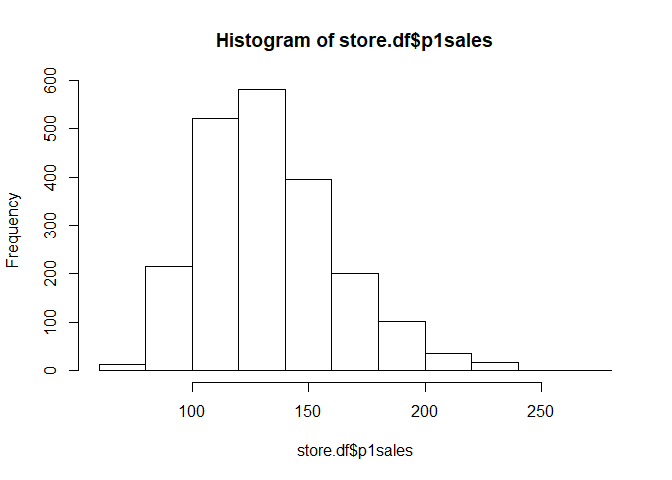<!-- -->

``` r
hist(store.df$p2sales)
```

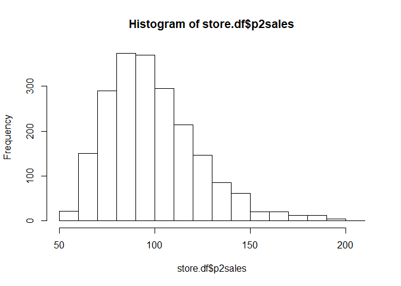<!-- -->

``` r
# clean it up a bit
hist(store.df$p1sales,
     main="Product 1 Weekly Sales Frequencies, All Stores",
     xlab="Product 1 Sales (units)",
     ylab="Count")
```

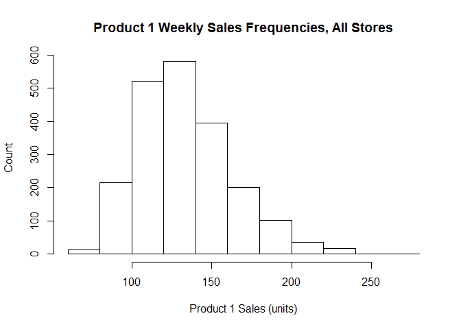<!-- -->

``` r
# add more columns (breaks or bins) and color the bars
hist(store.df$p1sales,
     main="Product 1 Weekly Sales Frequencies, All Stores",
     xlab="Product 1 Sales (units)",
     ylab="Count",
     breaks=30,
     col="lightblue")
```

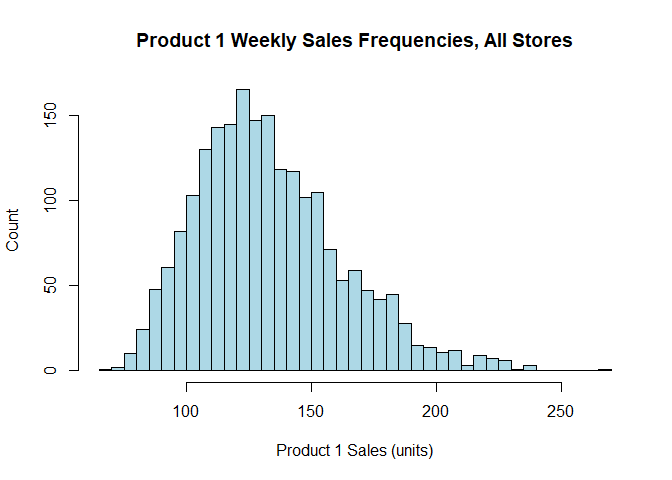<!-- -->

``` r
# use density instead of counts on y, and remove the x-axis
hist(store.df$p1sales,
     main="Product 1 Weekly Sales Frequencies, All Stores",
     xlab="Product 1 Sales (units)",
     ylab="Relative Frequency",
     breaks=30,
     col="lightblue",
     freq = FALSE,         # plot density instead of counts
     )             # means set x-axis tick marks == no
```

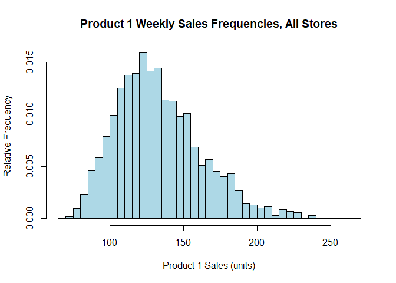<!-- -->

``` r
# use density instead of counts on y, and remove the x-axis
hist(store.df$p1sales,
     main="Product 1 Weekly Sales Frequencies, All Stores",
     xlab="Product 1 Sales (units)",
     ylab="Relative Frequency",
     breaks=30,
     col="lightblue",
     freq = FALSE, 
     xaxt="n",
     ) 

axis(side=1, at=seq (60 , 300 , by =20))    # add "60" , "80" , ...)

lines(density(store.df$p1sales , bw =10) , # "bw = ..." adjusts the smoothing
      type="l" , col="darkred" , lwd =2) # lwd = line width
```

<!-- -->

``` r
# a boxplot of p2sales for all store
boxplot(store.df$p2sales , 
        xlab="Weekly sales" , 
        ylab="P2",
        main="Weekly sales of P2 , All stores", 
        horizontal=TRUE)
```

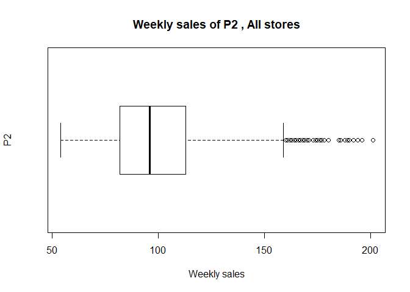<!-- -->

``` r
# a separate boxplot for each store
boxplot(store.df$p2sales ~ store.df$storeNum, 
        horizontal=TRUE,
        ylab="Store", 
        xlab="Weekly unit sales", 
        las=1,                                  # las=1 forces axis text to horizontal
        main="Weekly Sales of P2 by Store")
```

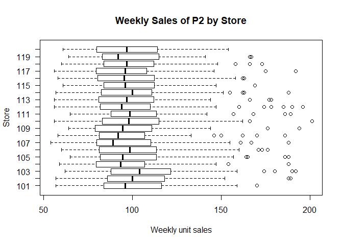<!-- -->

``` r
# using data= can make variables easier to enter
# promotion makes a difference!
boxplot(p2sales ~ p2prom, data=store.df , 
        horizontal=TRUE, 
        yaxt="n",
        ylab="P2 promoted in store?", 
        xlab="Weekly sales",
        main="Weekly sales of P2 with and without promotion")

axis(side=2, at=c(1,2) , labels=c("No", "Yes"))
```

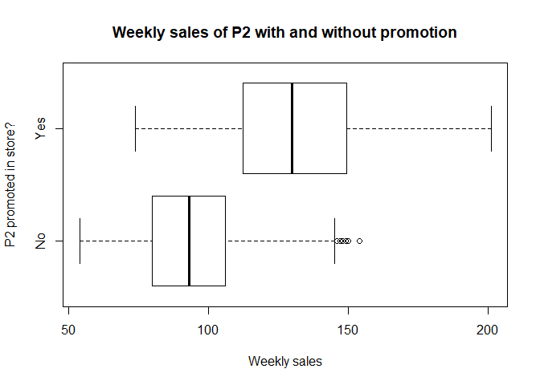<!-- -->

``` r
# beanplots
library(beanplot)
beanplot(p2sales ~ p2prom , data=store.df , horizontal=TRUE , yaxt="n",
         what=c(0,1,1,0) , log="" , side="second",
         ylab="P2 promoted in store?" , xlab="Weekly sales",
         main="Weekly sales of P2 with and without promotion")

axis(side=2, at=c(1,2) , labels=c("No", "Yes"))
```

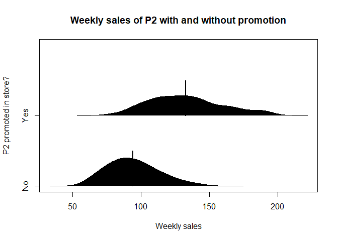<!-- -->

``` r
# QQ Plot to check normality

# first compare data to a normal distribution
qqnorm(store.df$p1sales)
# then add normal line to plot
# note the upward skew (deviation from normality)
qqline(store.df$p1sales)
```

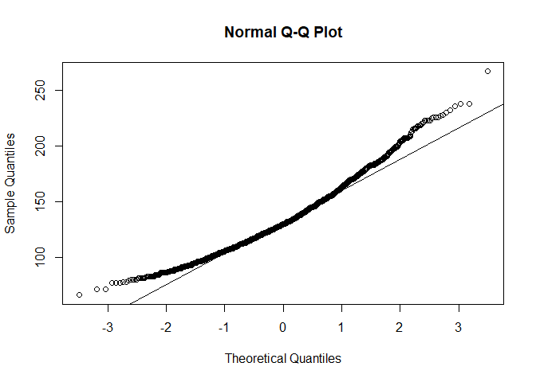<!-- -->

``` r
# try same after transforming the data
qqnorm(log(store.df$p1sales))
qqline(log(store.df$p1sales))
```

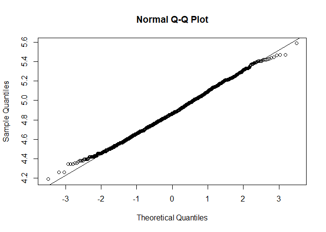<!-- -->

``` r
# empirical cumulative distribution function (ecdf)
# shows the cumulative proportion of data values in your sample
ecdf(store.df$p1sales)
```

    ## Empirical CDF 
    ## Call: ecdf(store.df$p1sales)
    ##  x[1:154] =     66,     71,     77,  ...,    238,    267

``` r
# now plot it
plot(ecdf(store.df$p1sales),
     main="Cumulative distribution of P1 Weekly Sales",
     ylab="Cumulative proportion",
     xlab=c("P1 weekly sales, all stores", 
            "90% of weeks sold <= 171 units"),
     yaxt="no")

# add custom y-axis
axis(side=2, at=seq(0, 1, by =0.1) , las=1,
     labels=paste(seq(0,100,by =10) , "%" , sep=""))

# Where would 90% of sales occur - the 90th percentile of P1 weekly sales
# add horizontal dotted line at 90%
abline(h=0.9 , lty =3) # "h=" for horizontal line ; " lty =3" for dotted

# add a vertical dotted line at the 90th percentile
abline(v=quantile(store.df$p1sales , pr =0.9) , lty =3) # "v=" vertical line
```

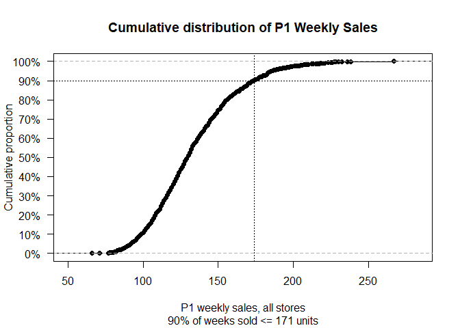<!-- -->

``` r
# Note on chart above: Cumulative distribution plot with lines to 
# emphasize the 90th percentile. The chart identifies that 90% of weekly 
# sales are lower than or equal to 171 units. Other values are easy to 
# read off the chart. For instance, roughly 10% of weeks sell less than 
# 100 units, and fewer than than 5% sell more than 200 units
```
